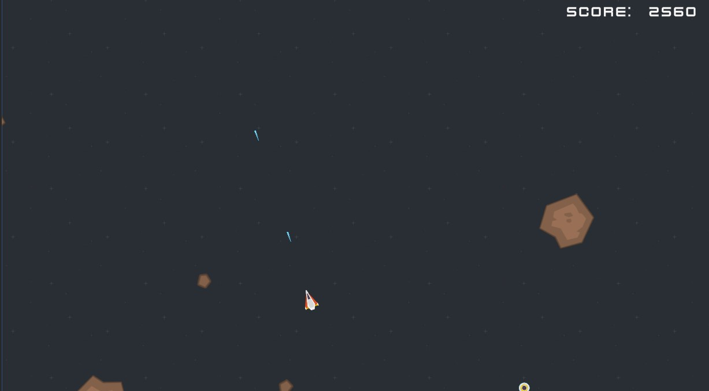
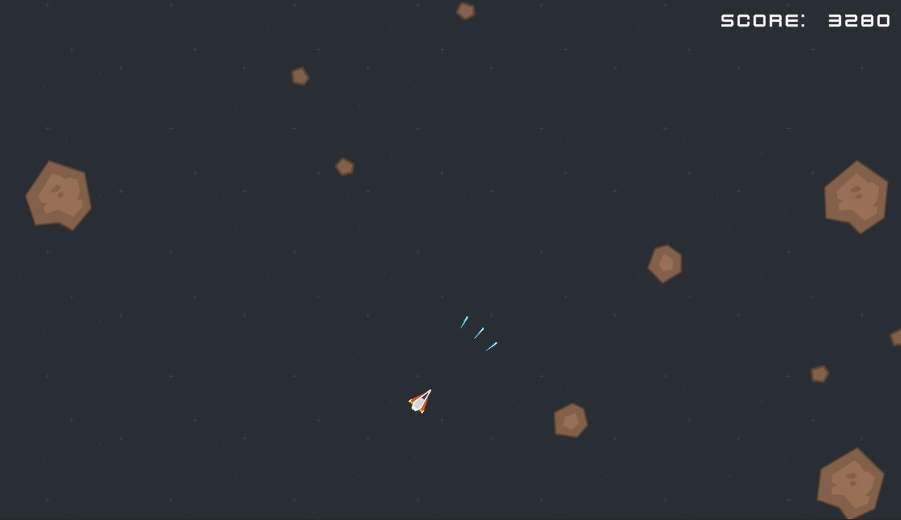

# AsteroidsDOTS
Game prototype inspired by the classic _Asteroids_, implemented in a Data Oriented way using **Unity DOTS** packages in `Unity 2020.2.7f1` version.

The input actions available for the prototype are:
|Input|Key|
|:--|:--|
|Rotate Ship Left| `A`|
|Rotate Ship Right| `D`|
|Move Ship Forward|`W`|
|Shoot|`Space` |
|Hyperspace Travel |`X`|

Please refer to the documentation (use .md or .pdf extensions at your convenience) to read about design decisions and implementation details.
## Game Screenshots

**Double Fire Rate powerup**

**Triple Shot powerup**

